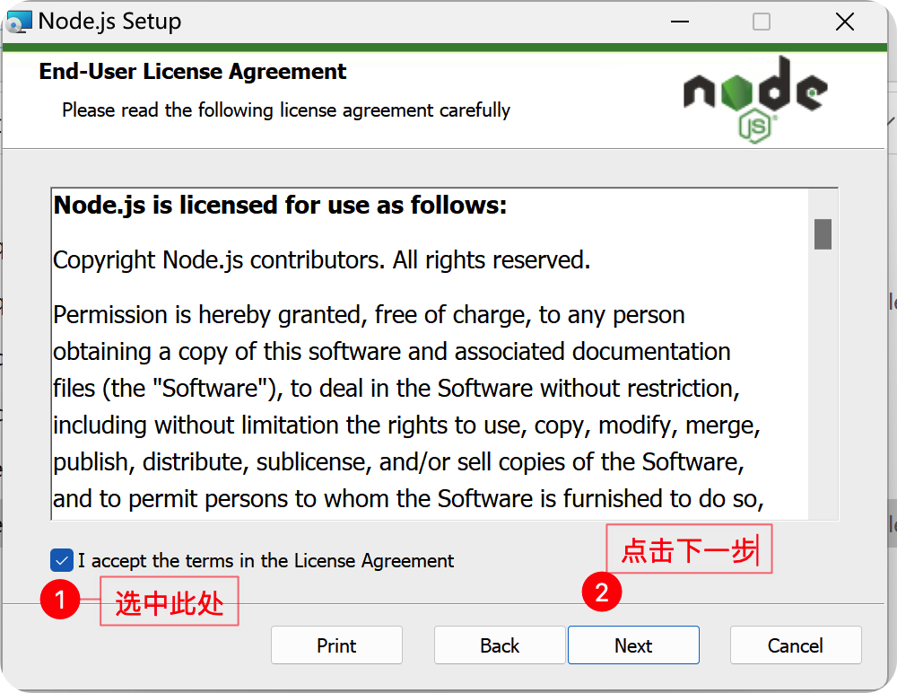

### 1.软件的架构

#### 1.1 C/S

#####         即Client/Server(客户端/服务器)结构,它可以分为客户端和服务器两层：第一层是在客户机系统上结合了界面显示与业务逻辑，第二层是通过网络结合了数据库服务器。

#####         C/S架构的优点：

​            1.C/S架构的界面和操作可以很丰富。（客户端操作界面可以随意排列，满足客户的需要）

​			2.安全性能可以很容易保证。（它可以对权限进行多层次校验，提供了更安全的存取模式，对信息安全的控制能力很强。一般高度机密的信息系统采用C/S结构适宜）

​			 3.由于只有一层交互，因此响应速度较快。（直接相连，中间没有什么阻隔或岔路，比如QQ，每天那么多人在线，也不觉得慢）

#####         C/S架构的缺点：

​            可以将QQ作为类比：

​			1.一般建立在专用的网络上, 小范围里的网络环境, 局域网之间再通过专门服务器提供连接和数据交换服  

​			务。

​			2.用户群固定。由于程序需要安装才可使用，因此不适合面向一些不可知的用户。

​			3.维护成本高，发生一次升级，则所有客户端的程序都需要改变。

​			例如qq，微信，王者荣耀。。。

#### 1.2 B/S架构

##### 		即Browser/Server(浏览器/服务器)结构，通过访问一个网页的形式来使用，将一些运算等操作放到远端的服务器上。

#####         B/S架构的优点：

​            1.客户端无需安装，有Web浏览器即可。 

​			2.BS架构可以直接放在广域网上，通过一定的权限控制实现多客户访问的目的，交互性较强。 

​			3.BS架构无需升级多个客户端，升级服务器即可。可以随时更新版本，而无需用户重新下载。

#####         B/S架构的缺点：

​            1.在跨浏览器上，BS架构不尽如人意。 

​			2.表现要达到CS程序的程度需要花费不少精力。 

​			3.在速度和安全性上需要花费巨大的设计成本，这是BS架构的最大问题。 

​			4.客户端服务器端的交互是请求-响应模式，通常需要刷新页面，这并不是客户乐意看到的。（在Ajax风行后此问题得到了一定程度的缓解）

​			例如，京东，淘宝。。。

##### HTTP协议（ HyperText Transport Protocol ）

​		HTTP是超文本传输协议的缩写，它用于传送WWW方式的数据。HTTP协议采用了请求/响应模型。客户端向服务器发送一个请求，请求头包含请求的方法、URL、协议版本、以及包含请求修饰符、客户信息和内容的类似于MIME的消息结构。服务器以一个状态行作为响应，响应的内容包括消息协议的版本，成功或者错误编码加上包含服务器信息、实体元信息以及可能的实体内容。

##### URL（ Uniform Resource Locator）统一资源定位符

URL就像每家每户都有一个门牌地址一样，每个网页也都有一个Internet地址。当你在浏览器的地址栏中输入一个URL或者单击一个超链接时，URL就确定了要浏览的地址。浏览器通过超文本传输协议(HTTP)，将Web服务器上站点的网页代码提取出来，并翻译成漂亮的网页。URL的格式如下：
协议://ip:port/path  例如：[http://192.168.1.101:80/test/index.html](http://192.168.1.101:80/test/index.html)

### 2.前后端分离开发

​		以Java Web项目为例，在传统的开发模式中，前端代码（Html、css、js）写在JSP中，甚至JSP中嵌入Java代码。当用户访问网站时，页面数据也就是Html文档，由Servlet容器将jsp编译成Servlet，然后将jsp中的html，css，js代码输出到浏览器，这个过程需要经过很多步骤，才能响应用户的请求。这个过程非常繁琐，效率低下，直接造成了页面响应速度慢的效果。从项目维护的角度上，传统的开发模式，前端代码和后端代码耦合在一起，导致代码混乱不堪，极大的降低了项目的可维护性，增加了维护成本。从开发角度来看，研发人员在开发过程中，不仅要设计后端架构还要兼顾前端展示，导致开发效率低下，延长开发周期。扬长避短，为什么不让专业的人去做专业的事？
​    	传统的开发模式下的系统数据交互图：

##### 传统开发模式的劣势和不足

​	1.开发出的软件响应速度慢，质量差，用户体验差。
​	2.前后端严重耦合，代码混乱，可维护性差。
​	3.研发人员前后端兼顾，开发效率低下，研发周期变长。
​	为了解决传统开发模式中的这些病痛，前后端分离框架应用而生。

##### 什么是前后端分离？

​		在前后端分离的开发模式中，后端仅返回前端所需的数据，前端负责渲染HTML页面，后端不再控制前端的效果，用户看到什么样的效果，从后端请求的数据如何加载到前端中，都由前端自己决定，后端仅仅需要提供一套逻辑对外提供数据即可，并且前端与后端的耦合度相对较低，在这种模式中，我们通常将后端开发的每个视图都成为一个接口，或者API，前端通过访问接口来对数据进行增删改查。总结一句话，后台负责提供数据，前端负责数据展示，职责分离，分工明确。对应的数据交互如下图

##### 总结

​    从经典的JSP+Servlet+JavaBean的MVC时代，到SSM（Spring + SpringMVC + Mybatis）和SSH（Spring + Struts + Hibernate）的Java 框架时代，再到前端框架（VueJS、AngularJS、ReactJS）为主的MV*时代，然后是NodeJS引领的全栈时代，技术和架构一直都在进步。虽然“基于NodeJS的全栈式开发”模式很让人兴奋，但是把基于Node的全栈开发变成一个稳定，让大家都能接受的东西还有很多路要走。创新之路不会止步，无论是前后端分离模式还是其他模式，都是为了更方便得解决需求，但它们都只是一个“中转站”。前端项目与后端项目是两个项目，放在两个不同的服务器，需要独立部署，两个不同的工程，两个不同的代码库，不同的开发人员。前端只需要关注页面的样式与动态数据的解析及渲染，而后端专注于具体业务逻辑。

### 3.什么是大前端?

​		简单来说，大前端就是所有前端的统称，比如Web、Android、iOS、Watch等，最接近用户的那一层也就是UI层，然后将其统一起来，就是大前端。

​    	由于node的出现，前端工程师不需要依赖于后端程序而直接运行，从而前后端分离起来。所以当开发一个新产品的时候服务只需要写一次，但是面向用户的产品可能有很多，例如网站、Android客户端、iOS客户端和微信小程序等。由于各个平台使用的技术栈都不一样，代码无法复用，非常浪费人力、物力。那么有没有什么技术能够解决这一痛点呢？大前端应运而生，其实大前端的主要核心就是跨平台技术，有了跨平台技术，各个平台的差异性就抹平了，开发者只需要一套技术栈就可以开发出适用于多个平台的客户端。

​		大前端的学习流程 
​		HTML5/CSS3->云服务器->JavaScript(核心)->jQuery->HTML5 API->ES6(核心)->Vue（React）->原生App/混合式开发App/小程序->NodeJs

#### 3.1 前端开发需要掌握的技术

##### 		前端开发环境的搭建

​			安装nodejs，Vue等
​			安装编译工具VSCode，webstrom等

##### 		web前端基础

​			HTML
​			CSS 
​			JavaScript(ES5,ES6)

##### 		web前端框架

​			jQuery
​			Vue 2.0 ~ 3.0
​			React
​			Angular
​			第三方组件库(elementUI，iView，vant)

##### 		原生移动端(可选)

​			iOS - > C -> OC
​			Android -> Java/Kotlin

##### 		混合移动端开发

​			小程序，微信小程序 wx.xxx，支付宝小程序等 dd.xxx
​			ReactNative
​			Flutter

##### 数据可视化

​			HighCharts

​            Echarts

​			元宇宙

##### 		Node后端开发

​			CommonJS
​			RequireJS
​			Node.js

#### 3.2 软件开发流程

##### 		第一阶段：初始需求阶段

​			将自己的Idea或客户的需求进行合理的需求分析与市场调研，分析项目可行性。

##### 		第二阶段：原型设计阶段

​			将需求分析转化成未来系统符合用户期望的原型设计，原型设计完成后，审核并确认具体设计，准备进     

​			入开发编码阶段。

##### 		第三阶段：个性化开发阶段

​			软件开发设计：对整个软件系统进行设计，如UI界面设计、系统框架设计、数据库设计等，为系统开发

​			一个健壮的结构并调整设计使其与实现环境相匹配。

​			程序开发编码：在开发构建阶段，由程序员根据详细设计及计划，将所有应用程序功能开发并集成为产品。

​			软件测试阶段：测试要验证对象间的交互作用，验证软件中所有组件的正确集成，检验所有的需求已被正确的实现, 识别并确认缺陷在软件部署之前被提出并处理。

##### 		第四阶段：交付维护阶段

​			产品软件部署：部署的目的是成功的生成版本并将软件分发给最终用户。

​			正式验收交付：要确定软件、环境、用户是否可以开始系统的运作，交付阶段的重点是确保软件对最终

​			用户是可用的。

​			后期项目维护：软件产品发布后，根据需求变化或硬件环境的变化对应用程序进行修改。

### 4.前端环境配置安装-详细步骤

### 4.1.安装NodeJS

#### 在安装node前，先打开终端输入node -v命令查看是否已经安装node，如果有版本号显示，证明已经安装过node便不需要重复安装。如果已经安装过的，建议版本在14以上。没有安装的同学跟着下面的步骤进行安装即可。

#### 1.双击打开安装包文件

#### 2.进入到安装界面，点击Next

#### 3.同意条款，点击Next

#### 4.node的安装路径使用默认路径即可，因为node体量不大，对C盘不会造成什么影响，默认路径安装，可以省略配置环境变量的步骤。

#### 5.所有的选项选择配置完毕，点击Install安装即可

#### 出现如下提示代表安装成功，点击Finish即可

#### 6.打开cmd终端，输入node -v指令，查看版本号；如有版本号显示，代表node安装成功。

#### 注意：如果网速较慢，也可使用cnpm

##### node服务国内镜像源:npm install cnpm -g --registry=https://registry.npm.taobao.org

#### 使用mac的同学，打开后缀为pkg的安装包，一直下一步即可

### 4.2.安装VSCode

#### 1.双击对应的安装包

#### 2.选择同意，点击下一步

#### 3.软件安装路径可自定义，选择完毕后点击下一步

#### 4.建议创建桌面快捷方式，点击下一步

#### 点击安装，等待即可

#### 安装完成后，点击完成

#### 5.VSCode安装插件

#### 以安装汉化插件为例，点击搜索框，输入Chinese，选择对应的插件选择安装即可

#### 部分插件安装完毕后需要重启，点击Restart重启即可

#### 	所需安装插件

   	根据安装包提示下一步安装即可
   	安装所需插件：
   	   	Chinese - 汉化插件
   	   	HTML CSS Support - html，css快捷操作
   	  	HTML Preview - 提供预览HTML文档的能力
   	   	HTML Snippets - 完整的HTML标签，包括HTML5片段
   	   	open in browser - 允许您在默认浏览器或应用程序中打开当前文件
   	   	Vetur - VS Code的Vue工具
   	   	Vue 3 Snippets - 一个Vue.js 3和Vue.js 2的代码段扩展
   	   	Vue VSCode Snippets - 代码片段，它将增强您的Vue工作流

#### 修改默认终端为cmd

