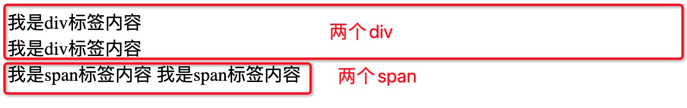
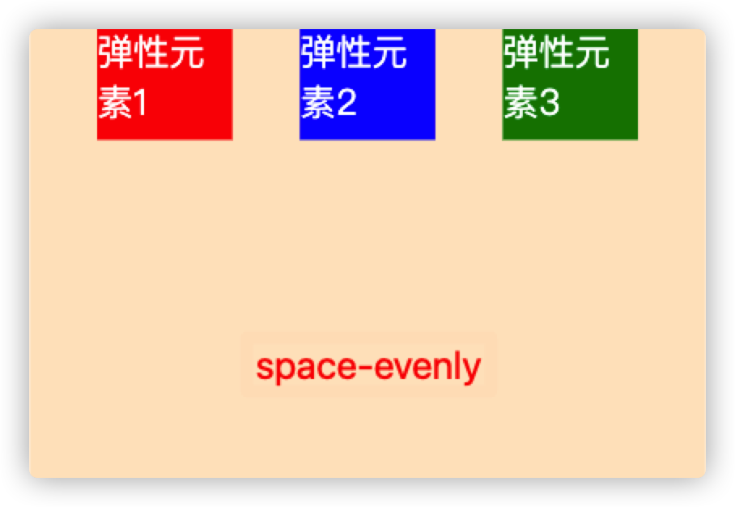
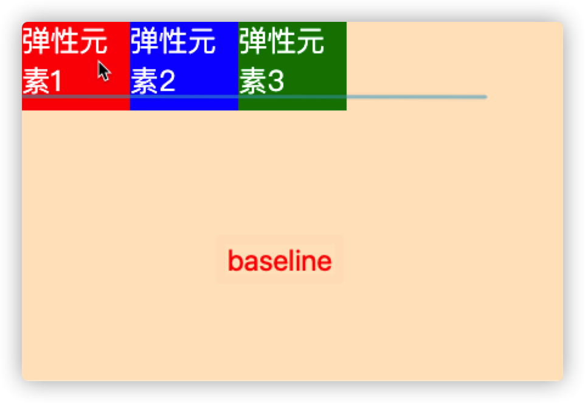
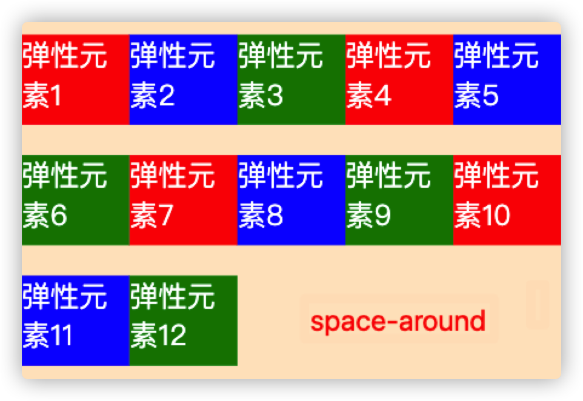
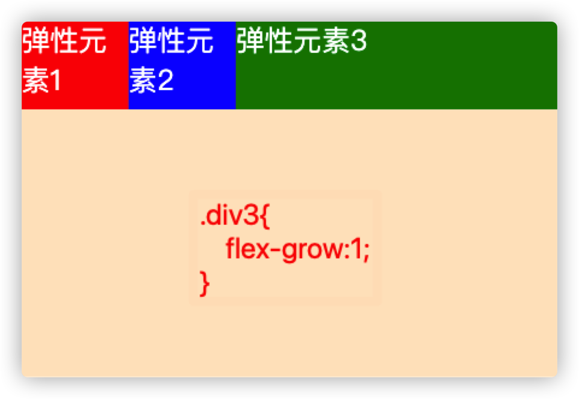
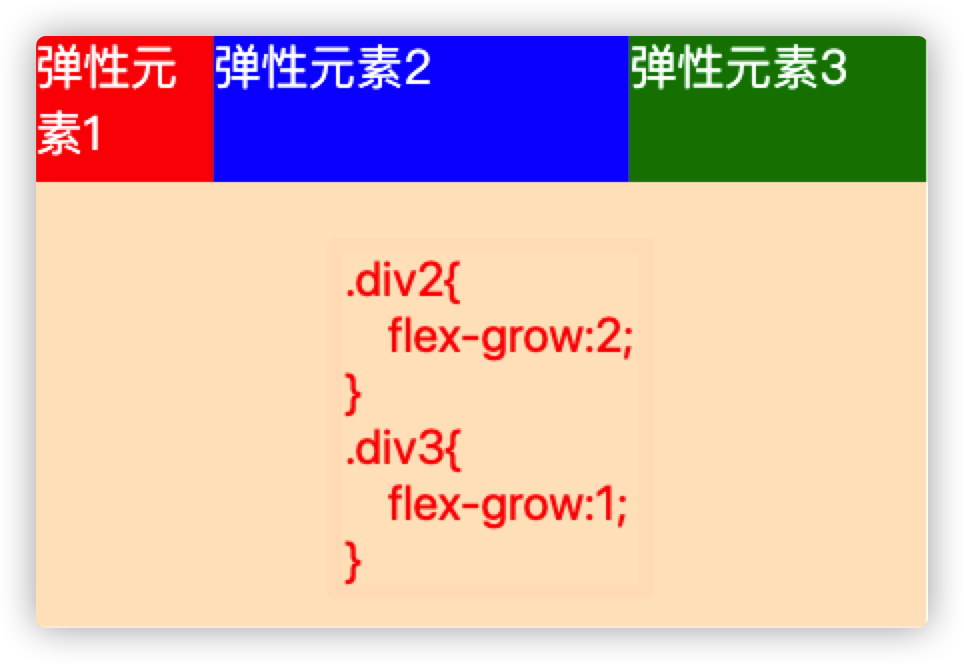

## 1.HTML5/CSS3

### 1.1.什么是HTML？什么是CSS？

#####     	HTML是HyperText Markup Language(超文本标记语言)

​		它不是一种编程语言，而是一种标记语言，用于告诉浏览器如何构造你的页面。他可以由一系列HTML元素组合成web开发人员想要的简单或者复杂的页面。“超文本”就是指页面内可以包含图片、链接，甚至音乐、程序等非文字元素。HTML也是一种规范，一种标准，它通过标记符号来标记要显示的网页中的各个部分。网页文件本身是一种文本文件，通过在文本文件中添加标记符，可以告诉浏览器如何显示其中的内容（如：文字如何处理，画面如何安排，图片如何显示等）。浏览器按顺序阅读网页文件，然后根据标记符解释和显示其标记的内容，对书写出错的标记将不指出其错误，且不停止其解释执行过程，编制者只能通过显示效果来分析出错原因和出错部位。可以使用.HTML与.htm作为HTML文件的后缀名（扩展名）
​    	HTML的发展
​    	• 1993年6月:HTML第一个版本发布。
​    	• 1995年11月:HTML2.0
​    	• 1997年1月:HTML3.2(W3C推荐)
   	 • 1999年12月:HTML4.01(W3C推荐) • 2000年底:XHTML1.0(W3C推荐)
​    	• 2014年10月:HTML5(W3C推荐)

#####     	CSS (Cascading Style Sheets) 层叠样式表

​		是一个用于修饰文档（可以是标记语言HTML，也可以是XML或者SVN）的语言，可以将文档以更优雅的形式呈现给用户

### 1.2.HTML和CSS之间的关系？

   1. HTML是网页内容的载体。内容就是网页制作者放在页面上想要让用户浏览的信息，可以包含文字、图片、视频等。

   2. CSS样式是表现。就像网页的外衣。比如，标题字体、颜色变化，或为标题加入背景图片、边框等。所有这些用来改变内容外观的东西称之为表现。

      ##### HTML就像是一个人，而CSS就像是衣服和化妆品，用来装饰HTML

### 1.3.结构，表现，行为

##### 	结构

#####         HTML用于描述页面的结构

#####     表现 

#####         CSS用于控制页面中元素的样式

#####     行为

#####         JavaScript用于响应用户操作

## 2.初识HTML

在VSCode编译器中新建后缀名为.html的文件，输入“ ! ”或其他快捷键生成基本的html结构

```html
<!-- 文档头信息 -->
<!-- html5标准网页声明 -->
<!-- h5的文档声明，声明当前的网页是按照HTML5标准编写的编写网页时一定要将h5的文档声明写在网页的最上边。
    如果不写文档声明，则会导致有些浏览器会进入一个怪异模式，进入怪异模式以后，浏览器解析页面会导致页面无法正常显示，所以为了避免进入该模式，一定要写文档声明
-->
<!DOCTYPE html>
<!-- 属性lang是单词language的缩写，意思是语言，”en”代表英语，”zh-CN”代表中文 -->
<!-- 
	html根标签，一个页面中有且只有一个根标签，网页中的所有内容都应该写在html根标签中
-->
<!-- 只有两个子标签 head:浏览器设置 body：可视区展示 -->
<html lang="en">
<!-- head标签，该标签中的内容，不会在网页中直接显示，它用来帮助浏览器解析页面的 -->
<head>
  <!--
				meta标签用来设置网页的一些元数据，比如网页的字符集，关键字、简介
        meta是一个自结束标签，编写一个自结束标签时，可以在开始标签中添加 一个/ 
  -->
  <!-- 
        字符编码，浏览器会根据字符编码进行解析
        常见的字符编码有：gb2312、gbk、unicode、utf-8。
  -->
  <meta charset="UTF-8">
  <!-- 
        viewport 设备的屏幕
        width=device-width width属性控制设备的宽度。假设您的网站将被带有不同屏幕分辨率的设备浏览，那么将它设置为 device-width 可以确保它能正确呈现在不同设备上。
        initial-scale=1.0 确保网页加载时，以 1:1 的比例呈现，不会有任何的缩放。
     -->
  <meta name="viewport" content="width=device-width, initial-scale=1.0">
  <!-- 浏览器选项卡上的名字 -->
  <title>Document</title>
</head>
<!--
	body标签用来设置网页的主体内容，网页中所有可见的内容，都应该在body中编写
-->
<body>
  <!-- 在body里的内容都是显示在浏览器的视图区的 -->
  <!-- 
    	在这个结构中，可以来编写HTML的注释注释中的内容，不会在页面中显示，但是可以在源码中查看我们可以通			过编写注释来对代码进行描述，从而帮助其他的开发人员工作,一定要养成良好的编写注释的习惯，但是注释一			 定要简单明了		
    -->
</body>
</html>
```

html4文档结构：

```xml
<!DOCTYPE HTML PUBLIC "-//W3C//DTD HTML 4.01 Transitional//EN" "http://www.w3.org/TR/html4/loose.dtd">
<html lang="en">
<head>
	<meta http-equiv="Content-Type" content="text/html;charset=UTF-8">
	<style type="text/css"></style>
	<script type="text/javascript"></script>
	<title>Document</title>
</head>
<body>
</body>
</html>
```

### 注释

```html
<!--注释的内容-->
```

### 标签结构介绍


### 2.1.块级元素

作用：搭建网页结构

特点：


* 独占一行空间
* 默认宽度为100%
* 高度由子元素或内容决定
* 可以通过css指定其宽高

元素：html、body、div、p、h1~h6、ul->li、ol->li、dl->dd/dt、header、footer、nav、article、section、aside、address...

建议：不要将块级元素嵌套在行内元素中。

| **元素** | **作用**                                    | **已有CSS效果**                   |
| :------- | :------------------------------------------ | :-------------------------------- |
| div      | 无意义的块元素                              |                                   |
| h1~h3    | 标题标题                                    | margin  font-size font-weight     |
| p        | 段落                                        | margin                            |
| ul,li    | 无序列表                                    | margin padding list-style         |
| ol,li    | 有序列表                                    | margin padding list-style         |
| dl,dt,dd | 定义列表                                    | dl - margin    dd - margin        |
| html     |                                             |                                   |
| body     |                                             | margin                            |
| header   | H5新增的语义化标签```<br>```(样式与div类似) | ```<div class="header"></div>```  |
| footer   |                                             | ```<div class="footer"></div>```  |
| nav      |                                             | ```<div class="nav"></div>```     |
| article  |                                             | ```<div class="article"></div>``` |
| section  |                                             | ```<div class="section"></div>``` |
| aside    |                                             | ```<div class="aside"></div>```   |
| address  |                                             | ```<div class="address"></div>``` |

### 2.2.行内元素

作用：在结构中填充网页内容

特点：

* 与其他行内元素共享一行空间
* 宽高由自身决定
* 由于不用来搭建网页结构，所以也无需通过css指定其宽度
* 行内元素中不可以嵌套块元素

元素：span、a、img、strong、b、i、em、sub、sup...


### 2.3.常用的标签

#### 基础标签`div`和`span`标签

div是一个无语义的标签，就是一个纯粹的块元素，并且不会为它里边的元素设置任何的默认样式，div元素主要用来进行页面基本结构的搭建。

span标签没有任何的语义，span标签绝大多数情况下用来选中文字，然后为文字来设置样式。

```html
<body>
  <div>我是div标签内容</div>
  <div>我是div标签内容</div>
  <span>我是span标签内容</span>
  <span>我是span标签内容</span>
</body>
```

页面展示效果如下



> div是块级元素，独占一行
>
> span是行内元素，与其他行内元素共享一行


#### 图像`img`标签

src:设置一个图片的路径（绝对路径和相对路径，最好使用相对路径）
alt:可以用来设置在图片不能显示时，对图片的描述
img标签的其他属性
width:设置图片的宽度
height:设置图片的高度
title：用于告诉浏览器，鼠标悬停的时候，需要弹出的描述框中显示什么内容。

```html
<!DOCTYPE html>
<html lang="en">

<head>
  <meta charset="UTF-8">
  <meta http-equiv="X-UA-Compatible" content="IE=edge">
  <meta name="viewport" content="width=device-width, initial-scale=1.0">
  <title>Document</title>
  <style>
    /* 设置img标签样式 */
    img {
      /* 设置宽 */
      width: 400px;
      /* 设置高 */
      height: 200px;
    }
  </style>
</head>

<body>
  
</body>

</html>
```

在页面中效果如图


注意点：

​		1.px 单位名称为像素，相对长度单位，像素px是相对于显示器屏幕分辨率而言的。像素的使用性特别广。使用px定义文字，无论用户怎么设置，都不会改变大小。

​    	2.如果不设置img标签的宽度和高度，那么图片就会按照默认的样式显示，如果设置了宽高，img就会按照设置的宽高来显示。

​        3.有时设置img的宽高会使图片失真，这时只需要设置宽度或者高度中的一个，另外一个会等比例调整。

​        4.一般除了自适应的页面，不建议设置width和height。

​        5.和h标签以及p标签不同的是，img标签不会独占一行

#### 超链接a标签

a标签的作用 用于控制页面与页面之间跳转的
a标签的格式 

```html
<a href="指定需要跳转的目标界面">需要展现给用户查看的内容</a>
<a href="https://www.baidu.com" target="_blank" title="百度">百度一下</a>
```

a标签中还有一个叫做target的属性，这个属性专门用于控制如何跳转
    self:用于当前的选项卡中进行跳转，也就是不新建页面跳转，默认就是_self
    _blank:用于在新的选项卡中进行跳转，也就是新建页面跳转
a标签也有一个title属性，效果和img标签的title类似

​    注意点:
​    1.a标签不仅可以让文字点击，也可以让图片被点击
​    2.一个a标签必须有一个href属性，否则a标签不知道要跳转到什么地方
​    3.如果通过a标签href属性指定一个URL地址，那么必须在地址前面加上http://或者https://
​    除了URL地址，还可以指定一个本地地址

#### video(H5新增)

作用：播放视频
webm 网页中专用的视频格式

```html
<video src="./static/Amazing design.mp4" controls></video>
```

video标签的属性
   src:告诉video标签需要播放的视频地址
   autoplay:用于告诉video标签是否需要自动播放视频
   controls:用于告诉video标签是否需要控制条
   poster:用于告诉video标签视频没有播放之前显示的占位图片
   loop:一般用于做广告视频，用于告诉video标签视频播放完毕之后是否需要循环播放
   muted:静音
   width/height: 和img标签中的一模一样
video的第二种格式
1.格式:

```
<video>
    <source src="" type=""></source>
    <source src="" type=""></source>
</video>
```

2.第二种格式存在的意义:
    由于视频数据非常非常的重要, 所以五大浏览器厂商都不愿意支持别人的视频格式, 所以导致了没有一种视频格式是所有浏览器都支持的
    这个时候W3C为了解决这个问题, 所以推出了第二个video标签的格式
    video标签的第二种格式存在的意义就是为了解决浏览器适配问题
    video 元素支持三种视频格式, 我们可以把这三种格式都通过source标签指定给video标签, 那么以后当浏览器播放视频时它就会从这三种中选择一种自己支持的格式来播放

3.注意点:
    3.1当前通过video标签的第二种格式虽然能够指定所有浏览器都支持的视频格式, 但是想让所有浏览器都通过video标签播放视频还有一个前提条件, 就是浏览器必须支持HTML5标签, 否则同样无法播放
    3.2在过去的一些浏览器是不支持HTML5标签的, 所以为了让过去的一些浏览器也能够通过video标签来播放视频, 那么我们以后可以通过一个JS的框架叫做html5media来实现

```html
<video autoplay="autoplay" controls="controls">
    <source src="images/sb1.webm" type="video/webm"></source>
    <source src="images/sb1.mp4" type="video/mp4"></source>
    <source src="images/sb1.ogg" type="video/ogg"></source>
</video>
```

#### audio(H5新增)

作用: 播放音频

格式:

```html
<audio src=""></audio>
<audio>
    <source src="" type="">
</audio>
```

注意点:
	audio标签的使用和video标签的使用基本一样, video中能够使用的属性在audio标签中大部分都能够使用, 并且功能都一样
	只不过有3个属性不能用, height/width/poster


推荐学习网站:

https://developer.mozilla.org/zh-CN/docs/Web/HTML

https://www.runoob.com/

## 3.CSS

- 什么是CSS
  	CSS (Cascading Style Sheets) 层叠样式表，是一个用于修饰文档（可以是标记语言HTML，也可以是XML或者SVN）的语言，可以将文档以更优雅的形式呈现给用户。
- HTML和CSS之间的关系？
      HTML是网页内容的载体。内容就是网页制作者放在页面上想要让用户浏览的信息，可以包含文字、图片、视频等。
       CSS样式是表现。就像网页的外衣。比如，标题字体、颜色变化，或为标题加入背景图片、边框等。所有这些用来改变内容外观的东西称之为表现。
       HTML就像是一个人，而CSS就像是衣服和化妆品，用来装饰HTML。
- 通过标签来修改样式的缺点:
      需要记忆哪些标签有哪些属性, 如果该标签没有这个属性, 那么设置了也没有效果。
      当需求变更时我们需要修改大量的代码才能满足现有的需求。
      HTML只有一个作用就是用来添加语义。
- 通过CSS来修改样式有什么好处?
      不用记忆哪些属性属于哪个标签。
      当需求变更时我们不需要修改大量的代码就可以满足需求。
      在前端开发中CSS只有一个作用, 就是用来修改样式。

学习网站：

https://developer.mozilla.org/zh-CN/docs/Web/CSS

https://www.w3school.com.cn/css/index.asp

### CSS 语法

CSS 规则集（rule-set）由选择器和声明块组成：


选择器指向需要设置样式的 HTML 元素。

声明块包含一条或多条用分号分隔的声明。

每条声明都包含一个 CSS 属性名称和一个值，以冒号分隔。

多条 CSS 声明用分号分隔，声明块用花括号括起来。

### 注释

```css
/* 这是一段注释 */
```

### CSS种类

+ 行内样式表(内联样式)

  内联样式表就是把css代码直接写在现有的HTML标签中，具体的使用方法如下面所示：

  ```html
  <div style="color:red">设置文字的颜色为红色</div>
  ```

  这里要注意：样式的内容写在元素的开始标签里，并且css样式代码要写在style=""双引号中，如果有多条css样式代码设置可以写在一起，中间用分号隔开。多个css样式写在一起的效果如下面所示：

  ```html
  <div style="color:red;font-size:14px">
      设置字体颜色为红色，并且字体大小为14px
  </div>
  ```

  这种样式只会对当前标签起作用，在测试的时候可以使用，不能对样式进行复用，不方便后期维护，不推荐使用

+ 内部样式表

  在head标签内的style标签内

  ```html
  <head>
    <meta charset="UTF-8">
    <meta http-equiv="X-UA-Compatible" content="IE=edge">
    <meta name="viewport" content="width=device-width, initial-scale=1.0">
    <title>Document</title>
    <style>
      /* 设置img标签样式 */
      img {
        /* 设置宽 */
        width: 400px;
        /* 设置高 */
        height: 200px;
      }
    </style>
  </head>
  ```

  使用内部样式表，进一步将表现和结构分离，可以同时为多个元素设置样式，方便后期的维护
  注意点:
      -style标签要写在head标签的开始标签和结束标签之间(也就是和title标签是兄弟关系)

  ​    -style标签中的type属性其实可以不用写, 默认就是type="text/css"

  ​    -设置样式时必须按照固定的格式来设置. key: value;其中:不能省略, 分号大多数情况下也不能省略

+ 外部样式表

  写在外部css文件中的，然后在head标签内使用link标签引入外部css样式。

  ```html
  <head>
    <meta charset="UTF-8">
    <meta http-equiv="X-UA-Compatible" content="IE=edge">
    <meta name="viewport" content="width=device-width, initial-scale=1.0">
    <title>Document</title>
    <link rel="stylesheet" href="./style/index.css">
  </head>
  ```

### CSS 常用选择器

```html
<!DOCTYPE html>
<html lang="en">

<head>
  <meta charset="UTF-8">
  <meta http-equiv="X-UA-Compatible" content="IE=edge">
  <meta name="viewport" content="width=device-width, initial-scale=1.0">
  <title>Document</title>
  <style>
    /* 通用选择器 * 选择所有的元素 */
    * {}

    /* 标签选择器，选择标签名为div的元素 */
    div {}

    /* id选择器，选择id属性值为two的元素 */
    #two {}

    /* class选择器，选择class属性值为three的元素 */
    .three {}

    /* 并集选择器，以逗号隔开，既选择div元素，又选择span元素 */
    div,span {}

    /* 后代选择器 以空格隔开，选择body元素后代中的div元素*/
    body div {}
  </style>
</head>

<body>
  <div>one</div>
  <div id="two">two</div>
  <div class="three">three</div>
  <div class="three">three</div>
  <span></span>
</body>

</html>
```

## CSS三大特性

#### - 继承性

​        作用: 给父元素设置一些属性, 子元素也可以使用, 这个我们就称之为继承性
​        注意点:
​        	1.并不是所有的属性都可以继承, 只有以color/font-/text-/line-开头的属性才可以继承
​        	2.在CSS的继承中不仅仅是儿子可以继承, 只要是后代都可以继承
​        	3.继承性中的特殊性
​            	3.1 a标签的文字颜色和下划线是不能继承的
​            	3.2 h标签的文字大小是不能继承的

```html
<div>
  <a href="https://www.baidu.com">百度一下</a>
  <p>我是p标签</p>
  <h1>我是h1标签</h1>
</div>
```

​    	应用场景:
​    		一般用于设置网页上的一些共性信息, 例如网页的文字颜色, 字体,文字大小等内容

#### - 层叠性

​    	作用: 层叠性就是CSS处理冲突的一种能力
​    	注意点:
   		 层叠性只有在多个选择器选中"同一个标签", 然后又设置了"相同的属性", 才会发生层叠性

#### - 优先级

​    	作用:当多个选择器选中同一个标签, 并且给同一个标签设置相同的属性时, 如何层叠就由优先级来确定

#####     	- 优先级判断的三种方式

​        	-间接选中就是指继承
​        	如果是间接选中, 那么就是谁离目标标签比较近就听谁的

​        	-相同选择器(直接选中)
​        	如果都是直接选中, 并且都是同类型的选择器, 那么就是谁写在后面就听谁的

​       	 -不同选择器(直接选中)
​        	如果都是直接选中, 并且不是相同类型的选择器, 那么就会按照选择器的优先级来层叠
​       	 id>类>标签>通配符>继承>浏览器默认

#####     	-优先级之!important

​        	作用: 用于提升某个直接选中标签的选择器中的某个属性的优先级的, 可以将被指定的属性的优先级提升为最高

​        	注意点:
​        		1.!important只能用于直接选中, 不能用于间接选中
​        		2.通配符选择器选中的标签也是直接选中的
​        		3.!important只能提升被指定的属性的优先级, 其它的属性的优先级不会被提升
​        		4.!important必须写在属性值得分号前面
​        		5.!important前面的感叹号不能省略
​        		6.但是一般建议不使用"!important",因为它会改变级联的工作方式，使得调试变得困难。

#####     	- 优先级权重

​        	作用: 当多个选择器混合在一起使用时, 我们可以通过计算权重来判断谁的优先级最高

​        	-权重的计算规则
​            		内联样式，如: style="..."，权值为1000。
​            		ID选择器，如：#content，权值为0100。
​            		类，伪类、属性选择器，如.content，权值为0010。
​            		标签选择器、伪元素选择器，如div p，权值为0001。
​            		通配符、复合选择器（+、>、~等）、否定伪类（：not）没有影响，权值为0000。
​            		继承的样式没有权值

​            	-首先先计算选择器中有多少个id, id多的选择器优先级最高
​            	-如果id的个数一样, 那么再看类名的个数, 类名个数多的优先级最高
​            	-如果类名的个数一样, 那么再看标签名称的个数, 标签名称个数多的优先级最高
​            	-如果id个数一样, 类名个数也一样, 标签名称个数也一样, 那么就不会继续往下计算了, 那么此时谁写				在后面听谁的

​            	也就是说优先级如果一样, 那么谁写在后面听谁的

​        注意点:
​        1.只有选择器是直接选中标签的才需要计算权重, 否则一定会听直接选中的选择器的

### 字体样式

+ color 	为字体指定颜色

  ​	颜色取值如下：

  ​		关键字：red,green,blue...
  ​		RGB：rgb(255,0,0),rgb(0,255,0),rgb(0,0,255)...
  ​		6位16进制：#ff0000,#00ff00,#0000ff...

+ font-size 	为文字指定大小

+ font-family 	为文字指定特殊的字体，浏览器只会使用浏览器可以访问到的字体

+ font-weight	为字体设置粗细程度

+ text-align 	文字排列方式

+ line-height  行高

```css
div {
  color: #ff0000;
  font-size: 20px;
  font-family: cursive, 宋体;
  font-weight: bold;
  text-align: center;
  line-height:40px;
}
```

### 盒子模型


#### 盒子属性

width & height		

​	用于设置内容区的宽高，该片区域用于显示内容。盒子高度默认为内容的高度

padding  内间距  

​	代表内容盒子的外边界与外边框的内边界之间的距离，取值规律如下

```css
/* 上 右 下 左 */
padding: 10px 20px 30px 40px;
/* 上 左右 下 */
padding: 10px 20px 30px;
/* 上下 左右 */
padding: 10px 20px;
/* 上下左右 */
padding: 10px;
/* 上 */
padding-top: 10px;
/* 下 */
padding-bottom: 10px;
/* 左 */
padding-left: 10px;
/* 右 */
padding-right: 10px;
```

border 边框

​	设定介于padding的外边缘与margin的内边缘之间，默认值为0

margin  外边距 

​	代表盒子四周的区域。属性值设置的方法与padding类似

#### 盒子种类

W3C盒子(标准盒子，默认，box-sizing:content-box;)
 内容区的宽	width
 内容区的高	height
 盒子的宽	width+paddingLeft+paddingRight+borderLeft+borderRight 
 盒子的高	height+paddingTop+paddingBottom+borderTop+borderBottom
 所占屏幕空间的宽	width+paddingLeft+paddingRight+borderLeft+borderRight+marginLeft+marginRight 
 所占屏幕空间的高	height+paddingTop+paddingBottom+borderTop+borderBottom+marginTop+marginBottom

IE盒子(box-sizing:border-box;)
 内容区的宽	width-paddingLeft-paddingRight-borderLeft-borderRight
 内容区的高	height-paddingTop-paddingBottom-borderTop-borderBottom
 盒子的宽	width 
 盒子的高	height
 所占屏幕空间的宽	width+marginLeft+marginRight 
 所占屏幕空间的高	height+marginTop+marginBottom

##### 标准盒子模型

```html
<!DOCTYPE html>
<html lang="en">

<head>
  <meta charset="UTF-8">
  <meta http-equiv="X-UA-Compatible" content="IE=edge">
  <meta name="viewport" content="width=device-width, initial-scale=1.0">
  <title>Document</title>
  <style>
    * {
      padding: 0;
      margin: 0;
    }

    div {
      width: 100px;
      height: 100px;
      padding: 50px;
      margin: 50px;
      border: 10px dashed #ccc;
      /*这里设置盒子模型为w3c标准盒子模型，也可不设置，默认就是w3c标准盒子模型*/
      box-sizing:content-box;
    }
  </style>
</head>

<body>
  <div>hello 你好</div>
</body>

</html>
```


##### IE盒子模型

```html
<!DOCTYPE html>
<html lang="en">

<head>
  <meta charset="UTF-8">
  <meta http-equiv="X-UA-Compatible" content="IE=edge">
  <meta name="viewport" content="width=device-width, initial-scale=1.0">
  <title>Document</title>
  <style>
    * {
      padding: 0;
      margin: 0;
    }

    div {
      width: 100px;
      height: 100px;
     	/*这里改为了10px是为了方便观看文字*/ 
      padding: 10px;
      margin: 50px;
      border: 10px dashed #ccc;
      /* 设置为IE盒子模型 */
      box-sizing: border-box;
    }
  </style>
</head>

<body>
  <div>hello 你好</div>
</body>

</html>
```


### 浮动布局

浮动布局的主要用法是为了让块级元素在一行中显示（列级布局），或者让文字在图片的周围显示。

float属性取值

​	left	   	向左浮动元素	    	

​	right    	向右浮动元素	     

​	none   	【默认值】，不浮动	

位于浮动元素下的非浮动元素会显示到浮动元素的下面，要想让该非浮动元素位于浮动元素之后（单独一行）需要清除浮动。在该元素上应用clear:both; 来清除浮动对元素本身产生的影响。   

```html
<!DOCTYPE html>
<html lang="en">

<head>
  <meta charset="UTF-8">
  <meta http-equiv="X-UA-Compatible" content="IE=edge">
  <meta name="viewport" content="width=device-width, initial-scale=1.0">
  <title>Document</title>
  <style>
    * {
      margin: 0;
      padding: 0;
    }

    div {
      width: 100px;
      height: 100px;
      background-color: #ccc;
    }

    .one {
      background-color: coral;
      /* 向左浮动 */
      float: left;
    }

    .two {
      background-color: cyan;
      /* 向左浮动 */
      float: left;
    }

    .three {
      /* 清除浮动对three产生的影响，如果不清除浮动，则看不到three */
      clear: both;
    }
  </style>
</head>

<body>
  <div class="one"></div>
  <div class="two"></div>
  <div class="three"></div>
</body>

</html>
```


### 定位布局

##### -定位流分类

​	1.1相对定位
​    1.2绝对定位
​    1.3固定定位
​    1.4静态定位

##### -什么是相对定位?

​    相对定位就是相对于自己以前在标准流中的位置来移动
​    position: relative;
​    使用top,right,bottom,left来控制

```html
<!DOCTYPE html>
<html lang="en">
<head>
    <meta charset="UTF-8">
    <meta name="viewport" content="width=device-width, initial-scale=1.0">
    <meta http-equiv="X-UA-Compatible" content="ie=edge">
    <title>Document</title>
    <style>
        *{
            margin: 0;
            padding: 0;
        }
        div{
            width: 100px;
            height: 100px;
        }
        .div1{
            background-color: red;
        }
        .div2{
            background-color: blue;
            position: relative;
            top: 40px;
            left: 40px;
        }
        .div3{
            background-color: brown;
        }
    </style>
</head>
<body>
    <div class="div1"></div>
    <div class="div2"></div>
    <div class="div3"></div>
</body>
</html>
```

##### -相对定位注意点

​	1.相对定位是不脱离标准流的, 会继续在标准流中占用一份空间
​	2.在相对定位中同一个方向上的定位属性只能使用一个
​	3.由于相对定位是不脱离标准流的, 所以在相对定位中是区分块级元素/行内元素/行内块级元素
​	4.由于相对定位是不脱离标准流的, 并且相对定位的元素会占用标准流中的位置, 所以当给相对定位的元素设置margin/padding等属性的时会影响到标准流的布局

##### -相对定位应用场景

​	1.用于对元素进行微调
​    2.配合后面学习的绝对定位来使用

##### -什么是绝对定位?

​	绝对定位就是相对于body来定位
​	position: absolute;

```html
<!DOCTYPE html>
<html lang="en">
<head>
  <meta charset="UTF-8">
  <meta http-equiv="X-UA-Compatible" content="IE=edge">
  <meta name="viewport" content="width=device-width, initial-scale=1.0">
  <title>Document</title>
  <style>
    .div1 {
      width: 100px;
      height: 100px;
      background-color: red;
    }
    .div2 {
      width: 200px;
      height: 200px;
      background-color: green;
      position: absolute;
      right: 0;
      top: 0;
    }
    .div3 {
      width: 200px;
      height: 200px;
      background-color: blue;
      position: relative;
    }
    .div4 {
      width: 50px;
      height: 50px;
      background-color: orange;
      position: absolute;
      margin-left: -25px;
      left: 50%;
      top:50%;
      margin-top: -25px;
    }
  </style>
</head>
<body>
  <div class="div1">1</div>
  <div class="div2">2</div>
  <div class="div3">
    <div class="div4"></div>
  </div>
</body>
</html>
```

##### -绝对定位参考点

​	1.默认情况下所有的绝对定位的元素, 无论有没有祖先元素, 都会以body作为参考点

​	2.如果一个绝对定位的元素有祖先元素, 并且祖先元素也是定位流, 那么这个绝对定位的元素就会以定位流的那个祖先元素作为参考点。
   	 2.1只要是这个绝对定位元素的祖先元素都可以
​    	2.2指的定位流是指绝对定位/相对定位/固定定位
​    	2.3定位流中只有静态定位不行

##### -绝对定位注意点

1.绝对定位的元素是脱离标准流的
2.绝对定位的元素是不区分块级元素/行内元素/行内块级元素
3.如果一个绝对定位的元素是以body作为参考点, 那么其实是以网页首屏的宽度和高度作为参考点, 而不是以整个网页的宽度和高度作为参考点
4.一个绝对定位的元素会忽略祖先元素的padding

##### -绝对定位-子绝父相

​	相对定位弊端:
​		相对定位不会脱离标准流, 会继续在标准流中占用一份空间, 所以不利于布局界面
​	绝对定位弊端:
​		默认情况下绝对定位的元素会以body作为参考点, 所以会随着浏览器的宽度高度的变化而变化
​	子绝父相
​		子元素用绝对定位, 父元素用相对定位

##### -绝对定位水平居中

​	只需要设置绝对定位元素的left:50%;
​	然后再设置绝对定位元素的 margin-left: -元素宽度的一半px;

##### -固定定位

​	1.什么是固定定位?
​		position: fixed;
​		固定定位可以让某个盒子不随着滚动条的滚动而滚动。

```html
<!DOCTYPE html>
<html lang="en">
<head>
  <meta charset="UTF-8">
  <meta http-equiv="X-UA-Compatible" content="IE=edge">
  <meta name="viewport" content="width=device-width, initial-scale=1.0">
  <title>Document</title>
  <style>
    .div1 {
      width: 100px;
      height: 100px;
      background-color: red;
      position: fixed;
      left: 0;
      bottom: 10px;
    }
  </style>
</head>
<body>
  <div class="div1">1</div>
  div{123123123}*200
</body>
</html>
```

​	注意点:
​		1.固定定位的元素是脱离标准流的, 不会占用标准流中的空间
​		2.固定定位和绝对定位一样不区分行内/块级/行内块级

## 1.flex布局

​	布局的传统解决方案，基于盒模型，依赖 display 属性 + position属性 + float属性。它对于那些特殊布局非常不方便，比如，垂直居中就不容易实现。

​	2009年，W3C 提出了一种新的方案----Flex 布局，可以简便、完整、响应式地实现各种页面布局。目前，它已经得到了所有浏览器的支持，这意味着，现在就能很安全地使用这项功能。

​	Flex 是 Flexible Box 的缩写，意为"弹性布局"，用来为盒状模型提供最大的灵活性。

​	任何一个容器都可以指定为 Flex 布局。

## 2.flex布局属性

> #### 容器属性
>
> - flex-flow
> - flex-direction
> - flex-wrap
> - justify-content
> - align-items
> - align-content
>
> #### 元素属性
>
> - order
> - flex-grow
> - flex-shrink
> - flex-basis
> - flex
> - align-self

## 3.flex弹性盒模型

​	采用 Flex 布局的元素，称为 Flex 容器（flex container），简称"容器"。它的所有子元素自动成为容器成员，称为 Flex 项目（flex item），简称"项目"。

​	对于某个元素只要声明了`display: flex;`，那么这个元素就成为了弹性容器，具有flex弹性布局的特性。


1. 每个弹性容器都有两根轴：**主轴和交叉轴**，两轴之间成90度关系。注意：**水平的不一定就是主轴。**
2. 每根轴都有**起点和终点**，这对于元素的对齐非常重要。 
3. 弹性容器中的所有子元素称为<弹性元素>，**弹性元素永远沿主轴排列**。
4. 弹性元素也可以通过`display:flex`设置为另一个弹性容器，形成嵌套关系。因此**一个元素既可以是弹性容器也可以是弹性元素**。

弹性容器的两根轴非常重要，所有属性都是作用于轴的。

#### 3.1.主轴

flex布局是一种**一维布局**模型，一次只能处理一个维度（一行或者一列）上的元素布局。

也就是说，**flex布局大部分的属性都是作用于主轴的，在交叉轴上很多时候只能被动地变化**。

我们可以在弹性容器上通过`flex-direction`修改主轴的方向。如果主轴方向修改了，那么：

1. 交叉轴就会相应地旋转90度。
2. 弹性元素的排列方式也会发生改变，因为**弹性元素永远沿主轴排列**。

**flex-direction属性**

取值：row(默认) | row-reverse | column | column-reverse

用于控制项目排列方向与顺序，默认row，即横向排列，项目排列顺序为正序1-2-3；row-reverse同为横向排列，但项目顺序为倒序3-2-1。

column 与row相反，为纵向排列，项目顺序为正序1-2-3，column-reverse同为纵向排列，项目顺序为倒序3-2-1。


#### 3.2.沿主轴的排列处理

弹性元素永远沿主轴排列，那么如果主轴排不下，该如何处理？

通过设置**flex-wrap属性**可使得主轴上的元素不换行、换行、反向换行。

取值：nowrap(默认) | wrap | wrap-reverse

用于控制项目是否换行，nowrap表示不换行；

举个例子：比如容器宽度为300px，容器中有6个宽度为60px的元素，nowrap情况下，项目会强行等分容器宽度从而不换行，那么项目实际宽度也就只有50px了，而非我们自己设置的60px。


wrap表示换行，即项目不会等分容器宽度，而是根据自身宽度进行排列，如果超出父容器宽度则自然换行。


wrap-reverse同样表示换行，需要注意的是第一排会紧贴容器底部，而不是我们想象的项目6紧贴容器顶部，效果与wrap相反。


#### 3.3.flex-flow属性

flex-flow属性是flex-deriction与flex-wrap属性的简写集合，默认属性为row nowrap，即横向排列，且不换行，如果需要控制项目排列与换行，推荐使用此属性，而非单独写两个。

#### 3.4.justify-content属性

取值：flex-start(默认) | flex-end | center | space-between | space-around | space-evenly;

用于控制项目在主轴上的对齐方式，默认flex-start即左对齐，center 为居中，对应的flex-end为右对齐。


space-between为左右两端对齐，即左右两侧项目都紧贴容器，且项目之间间距相等。


space-around为项目之间间距为左右两侧项目到容器间距的2倍，比较特别的布局，日常使用不太多。


space-evenly为项目之间间距与项目与容器间距相等，相当于除去项目宽度，平均分配了剩余宽度作为项目左右margin。



####  3.5.align-items属性

取值：flex-start | flex-end | center | baseline | stretch(默认)

用于控制项目在交叉轴排列方式，默认stretch即如果项目没设置高度，或高度为auto，则占满整个容器，下面第一张图的项目没设置高度，其余均为50px。


flex-start会让项目在交叉轴紧贴容器顶部，flex-end与之相反：


center使用最多，自然不会陌生，在交叉轴中心位置排列：


baseline比较特殊，它让项目以第一行文字的基线为参照进行排列：



注意，常理来说justify-content与align-items默认分别处理项目主轴，交叉轴的对齐方式，但如果我们修改了flex-direction为column，它们处理的轴向会交换，也就是justify-content处理交叉轴，align-items处理主轴。

想要使一个子元素垂直水平居中，只需要设置其父元素

```css
justify-content: center; /* 水平居中 */
align-items: center;     /* 垂直居中 */
```

#### 3.6.align-content

取值：flex-start | flex-end | center | space-between | space-around | space-evenly | stretch(默认);

用于控制多行项目的对齐方式，如果项目只有一行则不会起作用，需设置flex-wrap: wrap；默认stretch，即在项目没设置高度，或高度为auto情况下让项目填满整个容器，与align-items类似。注意，如下演示的12个项目均没有设置高度。


flex-start ，center，flex-end 与align-items属性表现一致：


space-around与justify-content保持一致，即项目之间间距为上下两端项目与容器间距两倍。



space-evenly同理，项目之间间距与项目到容器之间间距相等，space-between为上下两侧项目紧贴容器。


### 项目属性

介绍完容器属性，简单介绍下项目属性。容器属性是加在父容器上的，那么项目属性呢，就是写在项目/弹性元素上的，就好比容器属性给ul，项目属性给li差不多一个意思。

#### 3.8.order

取值：默认0，用于决定项目排列顺序，数值越小，项目排列越靠前。


#### **3.9.flex-grow**

取值：默认0，用于决定项目在有剩余空间的情况下是否放大，默认不放大；注意，即便设置了固定宽度，也会放大。

假设默认三个项目中前两个项目都是0，最后一个是1，最后的项目会占满剩余所有空间。



假设只有第一个项目默认为0，后面两个项目flex-grow均为1，那么后两个项目平分剩余空间。


假设第一个项目默认为0，第二个项目为flex-grow:2，最后一个项目为1，则第二个项目在放大时所占空间是最后项目的两倍。



#### **3.10.flex-shrink**

取值：默认1，用于决定项目在空间不足时是否缩小，默认项目都是1，即空间不足时大家一起等比缩小；注意，即便设置了固定宽度，也会缩小。

但如果某个项目flex-shrink设置为0，则即便空间不够，自身也不缩小。


上图中第二个项目flex-shrink为0，所以自身不会缩小。

#### **3.11.flex-basis**

取值：默认auto，用于设置项目宽度，默认auto时，项目会保持默认宽度，或者以width为自身的宽度，但如果设置了flex-basis，权重会比width属性高，因此会覆盖widtn属性。


```css
div{
  flex-basis: 80px;
  width: 60px;
  height: 50px;
  color: white;
}
```

上图中先设置了flex-basis属性，后设置了width属性，但宽度依旧以flex-basis属性为准。

#### **3.12.flex**

取值：默认0 1 auto，flex属性是flex-grow，flex-shrink与flex-basis三个属性的简写，用于定义项目放大，缩小与宽度。

该属性有两个快捷键值，分别是auto(1 1 auto)等分放大缩小，与none(0 0 auto)不放大不缩小。

还有最常用的flex:1 === flex: 1 1 0px

#### **3.13.align-self**

取值：auto(默认) | flex-start | flex-end | center | baseline | stretch，表示继承父容器的align-items属性。如果没父元素，则默认stretch。

用于让个别项目拥有与其它项目不同的对齐方式，各值的表现与父容器的align-items属性完全一致。


## animate.css

https://animate.style/

1.引入animate的cdn

```css
<link href="https://cdn.bootcdn.net/ajax/libs/animate.css/4.1.1/animate.min.css" rel="stylesheet">
```

2.给指定元素加入class"animate__animated <动效名称>"

```html
<div class="animate__animated animate__fadeInUpBig">你好 animate</div>
```
