## 疫情动态

#### 1.疫情数据相关接口

https://www.tianapi.com/apiview/169

```js
http://api.tianapi.com/ncov/index?key=3e8e8e29357d55fe43dd3858800f8bc2
```

所需参数

|          参数名称          |         说明         |
| :------------------------: | :------------------: |
| desc.currentConfirmedIncr  | 相比昨天现存确诊人数 |
|       desc.curedIncr       | 相比昨天新增治愈人数 |
|       desc.deadIncr        | 相比昨天新增死亡人数 |
| desc.currentConfirmedCount |     现存确诊人数     |
|     desc.seriousCount      |    现存无症状人数    |
|    desc.suspectedCount     |   累计境外输入人数   |
|    desc.confirmedCount     |     累计确诊人数     |
|      desc.curedCount       |     累计治愈人数     |

#### 2.国内病例调用接口

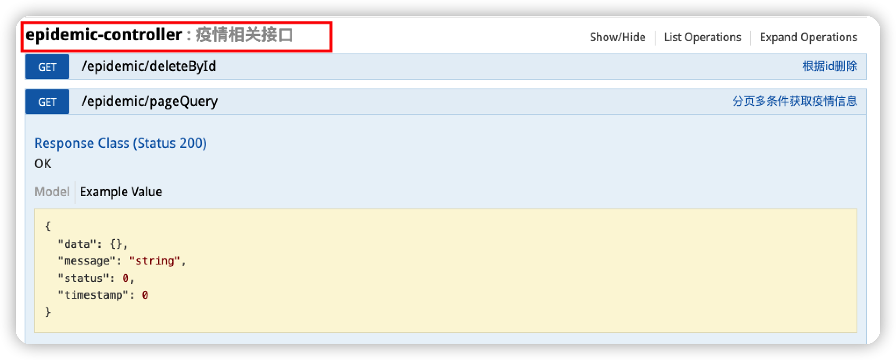

#### 3.最新进展调用接口

可以调用两个接口，如果想要限制条数，使用带分页的

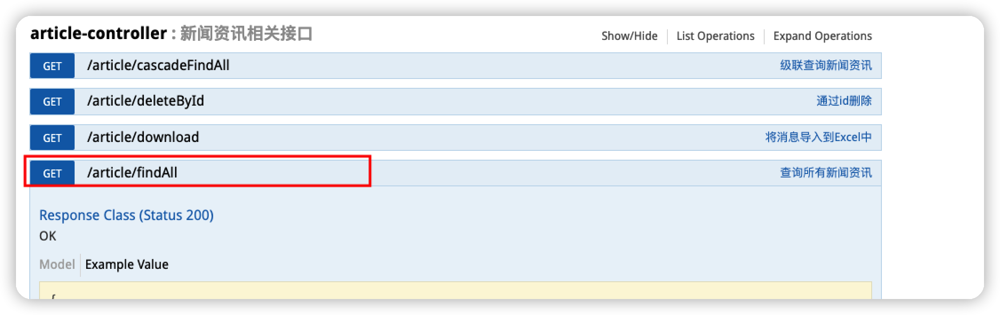

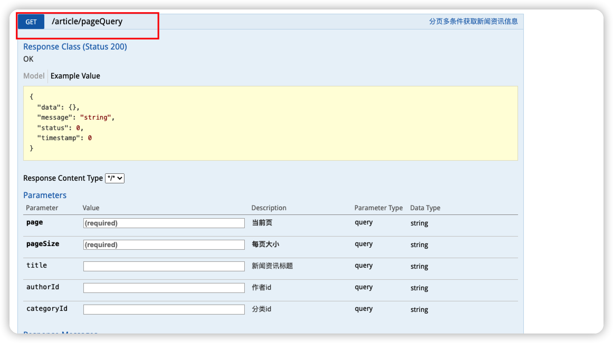


## 实时疫情

#### 1.在项目中使用highcharts

使用cdn的方式引入highcharts

https://www.highcharts.com.cn/docs/start-helloworld

```html
<script src="http://cdn.highcharts.com.cn/highcharts/highcharts.js"></script>
```

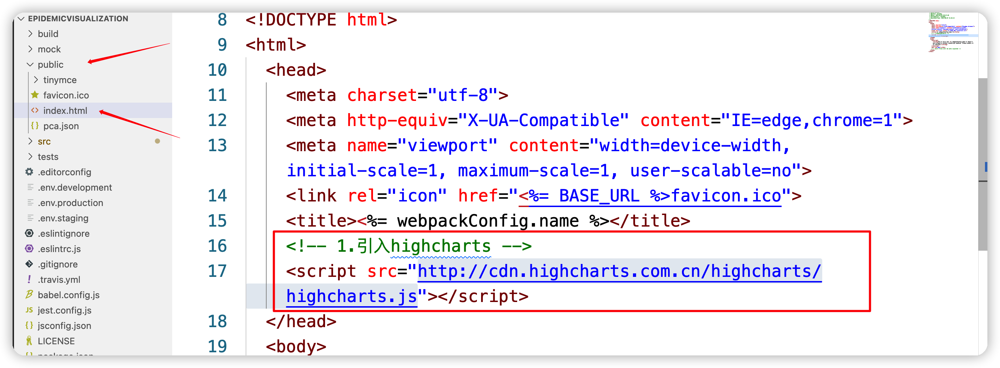

#### 使用

图表使用教程https://www.highcharts.com.cn/docs/basic-compose

1.创建接收图表的容器，注意使用id而不是class，图表容器推荐使用内联样式处理

```html
<!-- 创建一个图标容器 -->
<div id="city_container" style="width: 50%;height: 700px;"></div>
```

2.在mounted生命周期中生成HighCharts图表

```js
mounted() {
  Highcharts.chart("city_container", {
    chart: {
      type: "line",
    },
    title: {
      text: "城市疫情对比图",
    },
    subtitle: {
      text: "数据来源: 广西科技大学",
    },
    xAxis: {
      categories: [
        "一月",
        "二月",
        "三月",
        "四月",
        "五月",
        "六月",
        "七月",
        "八月",
        "九月",
        "十月",
        "十一月",
        "十二月",
      ],
    },
    yAxis: {
      title: {
        text: "数量 (个)",
      },
    },
    plotOptions: {
      line: {
        dataLabels: {
          // 开启数据标签
          enabled: true,
        },
        // 关闭鼠标跟踪，对应的提示框、点击事件会失效
        // enableMouseTracking: false,
      },
    },
    //鼠标移入提示，需要关闭鼠标追踪
    tooltip: {
      headerFormat: '<span style="font-size: 10px">{point.key}</span><br/>',
      pointFormat:
        '<span style="color:{series.color}">\u25CF</span> {series.name}: <b>{point.y}</b><br/>',
      shared: true,
    },
    series: [
      {
        name: "东京",
        data: [
          7.0, 6.9, 9.5, 14.5, 18.4, 21.5, 25.2, 26.5, 23.3, 18.3, 13.9, 9.6,
        ],
      },
      {
        name: "伦敦",
        data: [
          3.9, 4.2, 5.7, 8.5, 11.9, 15.2, 17.0, 16.6, 14.2, 10.3, 6.6, 4.8,
        ],
      },
    ],
  });
},
```

3.实时数据图

```html
<!-- 实时动态图 -->
<div id="realTime_container" style="height: calc(100vh / 2)"></div>
```

4.渲染实时数据图

```js
Highcharts.setOptions({
global: {
  useUTC: false,
},
});
function activeLastPointToolip(chart) {
var points = chart.series[0].points;
chart.tooltip.refresh(points[points.length - 1]);
}
var chart = Highcharts.chart("realTime_container", {
chart: {
  type: "spline",
  marginRight: 10,
  events: {
    load: function () {
      var series = this.series[0],
        chart = this;
      activeLastPointToolip(chart);
      setInterval(function () {
        var x = new Date().getTime(), // 当前时间
          y = Math.random(); // 随机值
        series.addPoint([x, y], true, true);
        activeLastPointToolip(chart);
      }, 1000);
    },
  },
},
title: {
  text: "动态模拟实时数据",
},
xAxis: {
  type: "datetime",
  tickPixelInterval: 150,
},
yAxis: {
  title: {
    text: null,
  },
},
tooltip: {
  formatter: function () {
    return (
      "<b>" +
      this.series.name +
      "</b><br/>" +
      Highcharts.dateFormat("%Y-%m-%d %H:%M:%S", this.x) +
      "<br/>" +
      Highcharts.numberFormat(this.y, 2)
    );
  },
},
legend: {
  enabled: false,
},
series: [
  {
    name: "随机数据",
    data: (function () {
      // 生成随机值
      var data = [],
        time = new Date().getTime(),
        i;
      for (i = -19; i <= 0; i += 1) {
        data.push({
          x: time + i * 1000,
          y: Math.random(),
        });
      }
      return data;
    })(),
  },
],
});
```

tip:Math.floor(Math.random() * 52 + 1)获取指定范围内的整数

## 数据统计

https://www.highcharts.com.cn/docs/highmaps-started

在项目中使用highmaps，如果highcharts和highmaps同时使用，需要按照以下规则进行导入，之前单独导入的highcharts可以注释掉

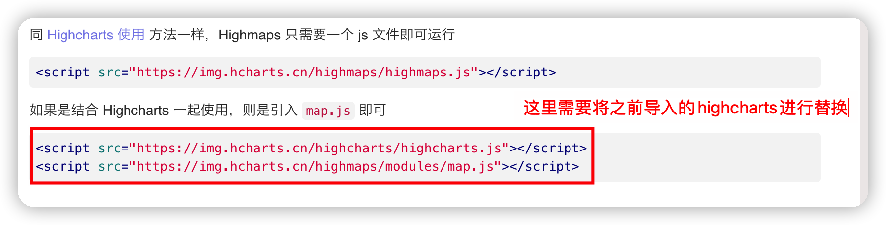

```html
<script src="https://img.hcharts.cn/highcharts/highcharts.js"></script>
<script src="https://img.hcharts.cn/highmaps/modules/map.js"></script>
```

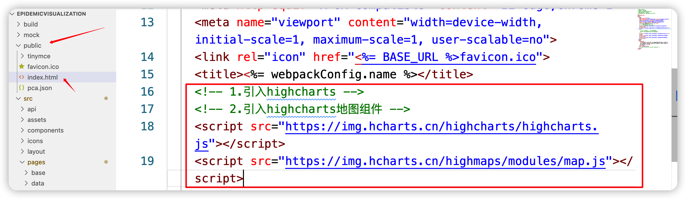

去highcharts官网找到合适自己的地图数据，比如说中国地图的数据

https://www.highcharts.com.cn/mapdata

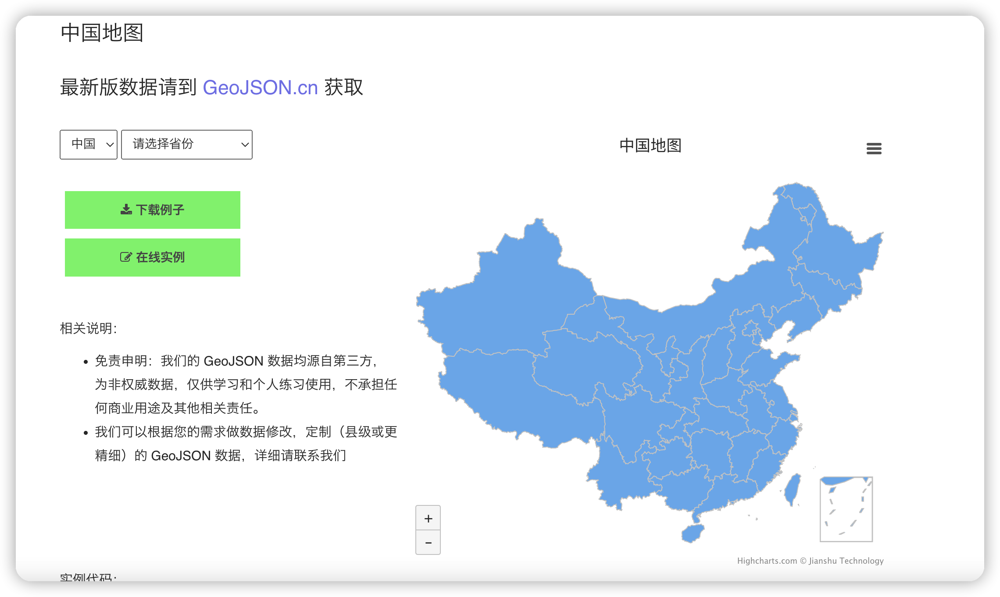

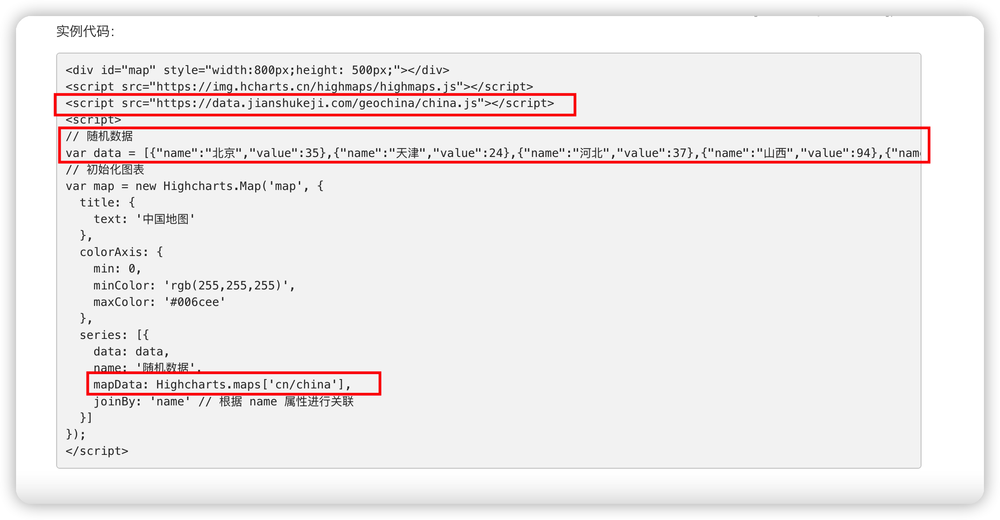

将所要使用的地图数据在index.html中进行导入

```html
<!--
  3.导入中国的数据和广西、上海的数据
  https://www.highcharts.com.cn/mapdata
-->
<script src="https://data.jianshukeji.com/geochina/china.js"></script>
<script src="https://data.jianshukeji.com/geochina/shanghai.js"></script>
<script src="https://data.jianshukeji.com/geochina/guangxi.js"></script>
```

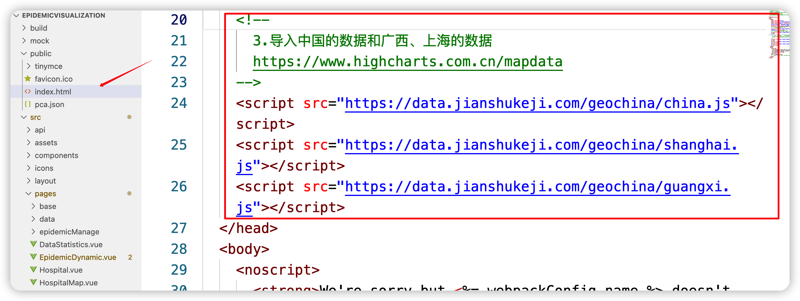

#### 注意：因为受网络原因影响，使用线上地图JSON数据可能会导致数据加载延时，建议使用本地地图json数据

#### https://geojson.cn/

#### 1.打开GeonJSON网站，点击TopoJSON，选择GeoJSON

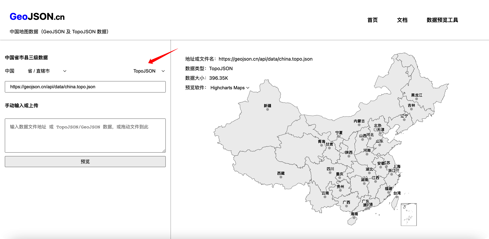

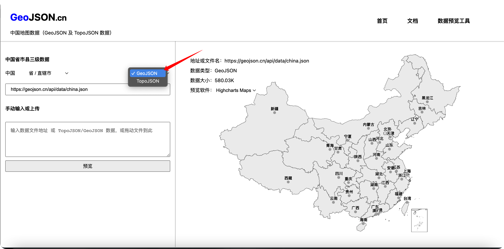

#### 2.将对应的url地址进行复制，在新的浏览器窗口中打开，将其中的代码进行复制，在项目中新建jsonData文件夹，进行保存

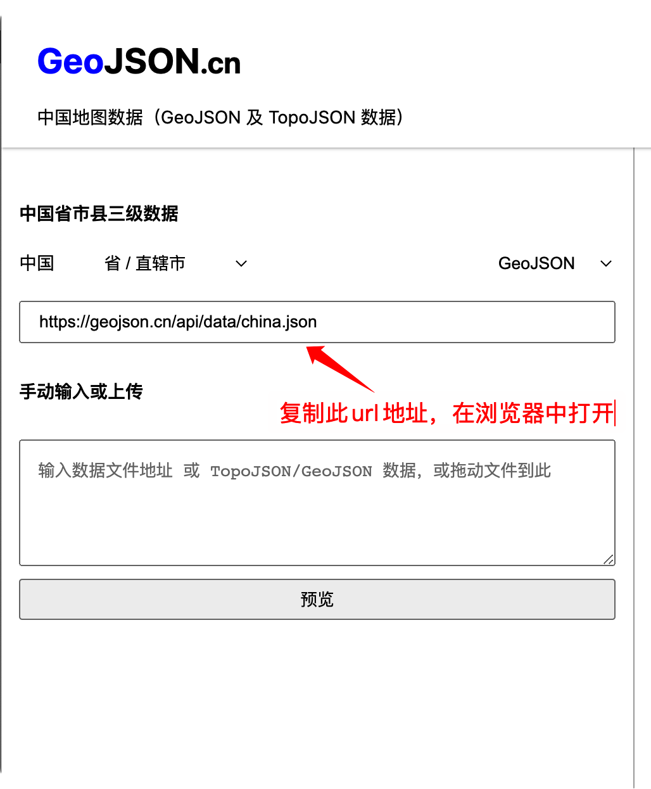

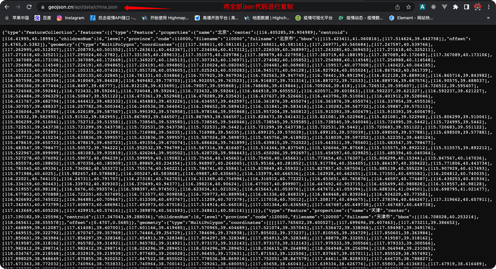

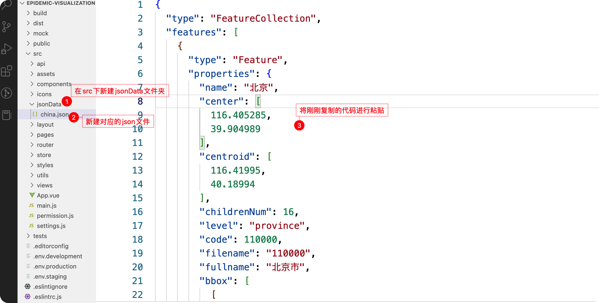

#### 3.然后在对应的模块中进行使用即可

#### 4..在对应页面中创建地图容器

```html
<!-- 中国地图 -->
<div id="china" style="height:600px"></div>
```

#### 5.创建加载地图的方法，在mounted生命周期中自动执行

```js
<script>
// 因为是第三方接口 所以需要导入axios
import axios from "axios";
export default {
  data() {
    return {
      // 国内各省市疫情数据
      chinaCovidData: [],
      // 广西疫情数据
      guangxiCovidData:[]
    };
  },
  mounted() {
    // 查询当前国内各省市疫情数据信息
    axios({
      url: "https://api.muxiaoguo.cn/api/epidemic?type=epidemicInfectionData&api_key=6f46fea09e825b0b",
    }).then((res) => {
      // 根据highmaps的data格式对获取到的数据进行过滤
      let resultChina = res.data.data.map((item) => {
        return {
          name: item.provinceShortName,
          value: item.currentConfirmedCount,
        };
      });
      // 国内疫情数据
      this.chinaCovidData = resultChina;
      // 加载中国地图
      this.loadChinaMap();

      // 广西疫情数据
      let resGuangxi = res.data.data.filter(item => {
        return item.provinceName == '广西壮族自治区'
      })
      // 修改数据格式
      this.guangxiCovidData = resGuangxi[0].cities.map(item => {
        return {
          name: item.cityName,
          value: item.currentConfirmedCount,
        };
      })
      // console.log(this.guangxiCovidData);
      this.loadGuangxiMap()
    });
  },
  methods: {
    // 加载中国地图
    loadChinaMap() {
      // 初始化图表
      let map = new Highcharts.Map("china", {
        title: {
          text: "中国地图",
        },
        colorAxis: {
          // 设置每个区间的颜色
          dataClasses: [
            {
              color: "#FFE1B3",
              to: 10,
            },
            {
              color: "#FDCFA7",
              from: 10,
              to: 100,
            },
            {
              color: "#FBB998",
              from: 100,
              to: 1000,
            },
            {
              color: "#FAA68A",
              from: 1000,
              to: 5000,
            },
            {
              color: "#F8947D",
              from: 5000,
              to: 10000,
            },
            {
              color: "#F57669",
              from: 10000,
              to: 50000,
            },
            {
              color: "#F2544E",
              from: 100000,
            },
          ],
        },
        series: [
          {
            // 将疫情数据进行赋值
            data: this.chinaCovidData,
            name: "共有疫情人数",
            mapData: Highcharts.maps["cn/china"],
            joinBy: "name", // 根据 name 属性进行关联
          },
        ],
      });
    },
    // 加载广西地图
    loadGuangxiMap() {
      // 初始化图表
      var map = new Highcharts.Map("guangxi", {
        title: {
          text: "广西壮族自治区",
        },
        colorAxis: {
          min: 0,
          minColor: "#FFE4B5",
          maxColor: "#F14746",
        },
        series: [
          {
            data: this.guangxiCovidData,
            name: "现有疫情人数",
            mapData: Highcharts.maps["cn/guangxi"],
            joinBy: "name", // 根据 name 属性进行关联
          },
        ],
      });
    },
  },
};
</script>
```

### tip:

疫情数据接口

https://api.muxiaoguo.cn/api/epidemic?type=epidemicInfectionData&api_key=6f46fea09e825b0b

## 定点医院

#### 获取当前定位，计算到目标地点的距离

##### 1.打开高德地图API网站，注册账号，获取JSAPI服务https://lbs.amap.com/

打开控制台，新建应用


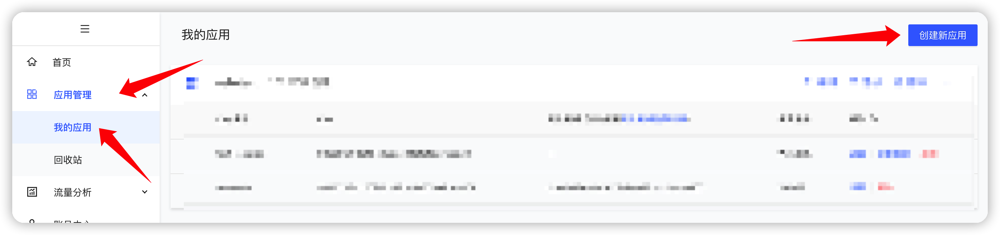

填写应用名称，选择应用类型

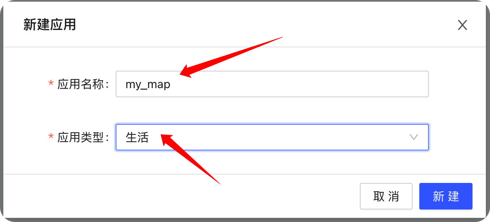

应用创建完毕后，选择添加，添加对应的功能

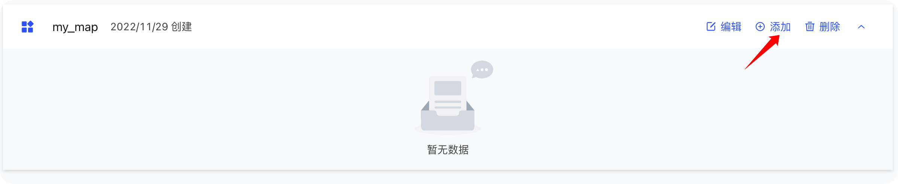

根据命名规范添加对应的key，选择JSAPI，点击提交

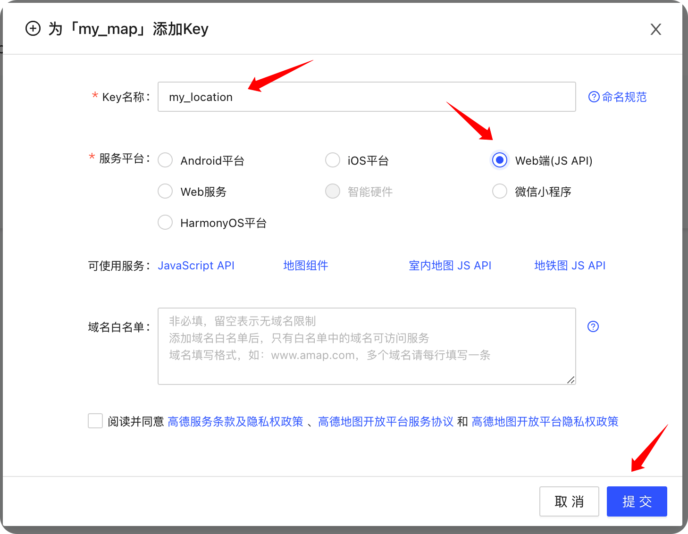

获取到自己的key进行使用

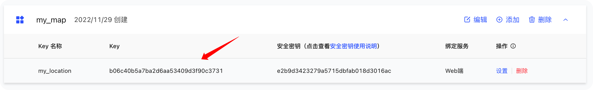

在index.html中使用高德地图JSAPI

```html
<script type="text/javascript" src="https://webapi.amap.com/maps?v=2.0&key=您申请的key值"></script> 
```

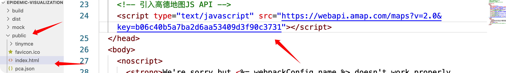

##### 2.在对应的模块中使用相关的API进行当前位置的获取，注意，浏览器要开启定位功能

```js
AMap.plugin('AMap.Geolocation', function() {
  var geolocation = new AMap.Geolocation({
    // 是否使用高精度定位，默认：true
    enableHighAccuracy: true,
    // 设置定位超时时间，默认：无穷大
    timeout: 10000,
    // 定位按钮的停靠位置的偏移量
    offset: [10, 20],
    //  定位成功后调整地图视野范围使定位位置及精度范围视野内可见，默认：false
    zoomToAccuracy: true,     
    //  定位按钮的排放位置,  RB表示右下
    position: 'RB'
  })

  geolocation.getCurrentPosition(function(status,result){
        if(status=='complete'){
            onComplete(result)
        }else{
            onError(result)
        }
  });

  function onComplete (data) {
    // data是具体的定位信息
    // 获取经度
    let longitude = data.position.lng
    // 获取纬度
    let latitude = data.position.lat
    console.log(longitude, latitude);

    // 获取到所有的医院信息经纬度 与当前定位的经纬度进行对比
    setTimeout(() => {
      that.hostipalData.map(item => {
        // 获取每个医院的经纬度
        let p1 = [item.longitude, item.latitude];
        // 获取当前位置的经纬度
        let p2 = [data.position.lng, data.position.lat];
        // 计算出距离
        let dis = AMap.GeometryUtil.distance(p1, p2);
        // 使用#set方法向每个医院对象中添加一个distance属性
        that.$set(item, "distance", (dis/ 1000).toFixed(2))
      })
    }, 500);
  }
	
  function onError (data) {
    // 定位出错
  }
})
```

#### 根据经纬度，显示目标位置地图

```vue
<template>
  <div class="hospital_map">
    <!-- 返回按钮 -->
    <el-button type="primary" @click="goBack">返回</el-button>
    <!-- 地图渲染的容器 -->
    <div id="container_hospital"></div>
  </div>
</template>
<script>
export default {
  data(){
    return {
      position:[116.397428, 39.90923]
    }
  },
  created(){
    // 获取医院的经纬度
    let {longitude,latitude} = this.$route.query;
    // 设置对应的经纬度格式
    this.position = [+longitude,+latitude]
  },

  // dom追加到网页中
  mounted(){
    // 使用高德地图API创建地图
    var map = new AMap.Map('container_hospital',{
       zoom:13,//级别
       center: this.position,
       viewMode:'3D'//使用3D视图
    });
    // 创建一个 Marker 实例：
    var marker = new AMap.Marker({
        position: this.position ,
        title: this.$route.query.name
    });

    // 将创建的点标记添加到已有的地图实例：
    map.add(marker);
  },
  methods: {
    goBack(){
      this.$router.go(-1)
    }
  },
}
</script>
<style scoped>
/* 样式，css */
#container_hospital {
  height:550px
}
</style>
```

### 级联选择器的使用

```vue
<!--
 * @Description:
 * @Author: ZachGmy
 * @Date: 2020-09-03 09:57:40
 * @LastEditors: ZachGmy
 * @LastEditTime: 2022-06-15 09:48:56
-->
<template>
  <div>
    <el-cascader
      v-model="form.pca"
      :props="{ label: 'name', value: 'name' }"
      :options="pca"
    ></el-cascader>
  </div>
</template>

<script>
import pca from "@/assets/pca.json";
export default {
  data() {
    return {
      form: {},
      pca,
    };
  },
};
</script>

<style scoped>
</style>

```

#### 其他所需接口

##### 定点医院管理

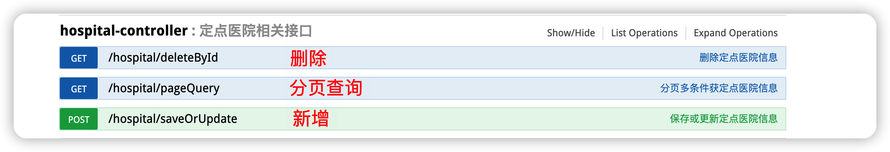

#### 咨询分类

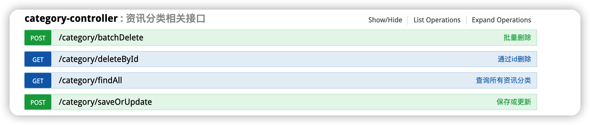

#### 新闻资讯

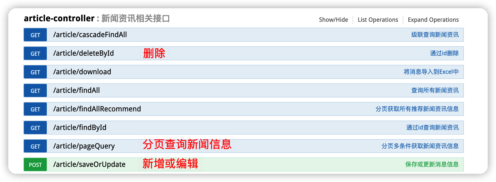

#### 疫情数据

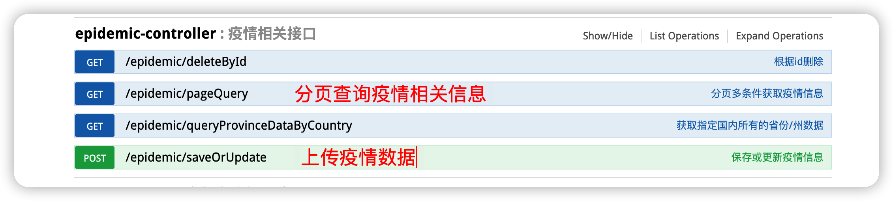